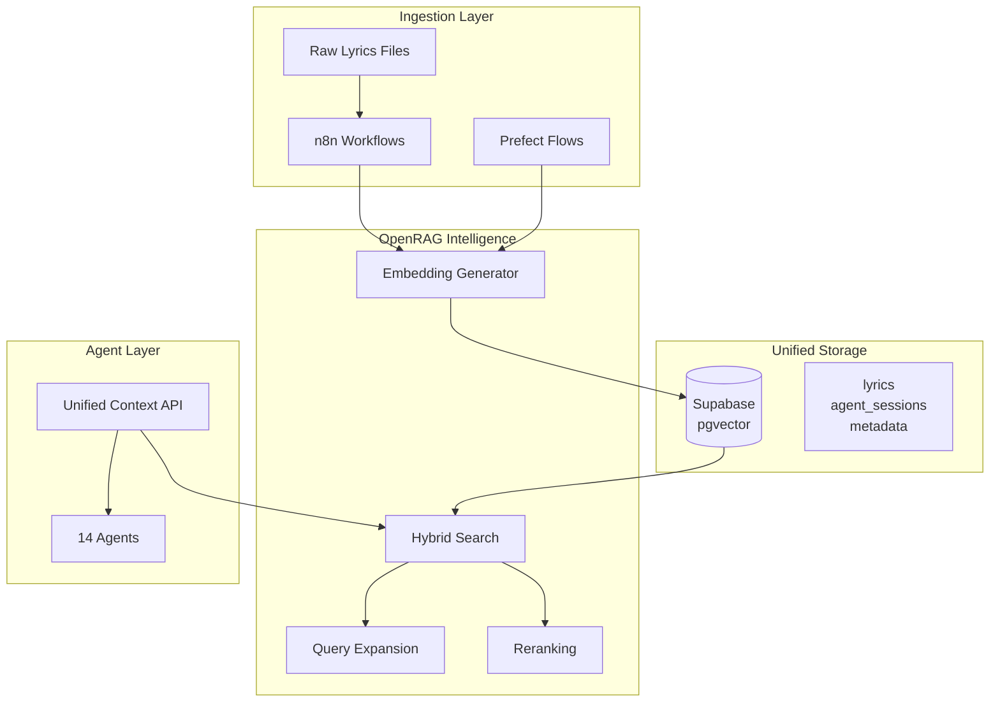

# KLM v2.3 Architecture - Unified Intelligence Framework

> **Version:** 2.3.0
> **Status:** READY FOR MIGRATION
> **Last Updated:** 2026-02-12

---

## Executive Summary

KLM v2.3 represents a strategic pivot from fragmented storage (ChromaDB placeholder + Supabase) to a **Unified Nervous System** using OpenRAG + Supabase pgvector.

### The Shift

| Aspect | v2.2 (Fragmented) | v2.3 (Unified) |
|--------|------------------|-----------------|
| Vector Store | ChromaDB (placeholder) | Supabase pgvector |
| Data Sync | Manual (not implemented) | Automatic (zero drift) |
| Search | None | Hybrid (SQL + semantic) |
| Intelligence | No retrieval layer | OpenRAG layer |

### Key Benefits

1. **Zero Data Drift** - Metadata and embeddings in same transaction
2. **Hybrid Search** - SQL filters + semantic search combined
3. **Self-Correction** - OpenRAG validates retrieved context
4. **Simplicity** - One database instead of two

---

## Architecture Diagram



---

## Components

### 1. Supabase + pgvector (Unified Storage)

Supabase now serves as the **single source of truth** for both relational data and vector embeddings.

#### Tables

| Table | Purpose | Key Columns |
|-------|---------|-------------|
| `lyrics` | Khmer song storage | title, artist, lyrics_khmer, embedding |
| `agent_sessions` | Agent memory | agent_id, summary, decisions, embedding |

#### Functions

| Function | Purpose |
|----------|---------|
| `hybrid_search_lyrics` | SQL filters + vector similarity |
| `search_similar_sessions` | Find related agent sessions |

### 2. OpenRAG Service (Intelligence Layer)

The OpenRAG service provides:

| Capability | Description |
|------------|-------------|
| **Embedding Generation** | text-embedding-3-large (1536 dimensions) |
| **Query Expansion** | Expands queries with related terms |
| **Hybrid Search** | Combines SQL + vector similarity |
| **Reranking** | Reorders by true relevance |

#### Code Location
- `backend/src/services/openrag_service.py`

### 3. Unified Context API (Agent Interface)

Agents call a single API for all context needs:

```python
from backend.src.api.context import get_context_for_agent

context = await get_context_for_agent(
    query="Ros Serey Sothea love songs",
    agent_id="AGT-002"
)
```

#### Endpoints

| Endpoint | Method | Description |
|----------|--------|-------------|
| `/context/retrieve` | POST | Get context for query |
| `/context/sources` | GET | List available sources |
| `/health` | GET | Service health check |

#### Code Location
- `backend/src/api/context.py`

### 4. Prefect Flows (Orchestration)

The ingestion pipeline now uses OpenRAG instead of ChromaDB:

```python
from prefect import flow

@flow(name="ingestion-pipeline-v23")
async def ingestion_pipeline(file_path: str):
    # Parse files
    lyrics_data = await parse_lyrics_file(file_path)

    # Generate embedding via OpenRAG
    embedding = await generate_embedding(lyrics_data)

    # Ingest to Supabase (metadata + embedding)
    result = await ingest_to_supabase(lyrics_data, embedding)

    return result
```

#### Code Location
- `30-Implementation/prefect/flows/ingestion_pipeline.py`

---

## Data Flow

### Ingestion Flow

```
1. Raw Lyrics (txt/csv)
   ↓
2. n8n Watch → Parse
   ↓
3. Generate Embedding (OpenRAG)
   ↓
4. Insert to Supabase pgvector
   ↓
5. Status: "processing" → "complete"
```

### Retrieval Flow

```
1. Agent Query
   ↓
2. OpenRAG Query Expansion
   ↓
3. Hybrid Search (SQL + Vector)
   ↓
4. Results Reranked
   ↓
5. Perfect Context Returned
```

---

## Migration Checklist

### Pre-Migration

- [ ] Enable pgvector in Supabase
- [ ] Run SQL migrations (001-003)
- [ ] Update .env with OpenRAG vars
- [ ] Remove CHROMADB_* vars

### Migration Steps

```bash
# 1. Enable pgvector (run in Supabase SQL Editor)
CREATE EXTENSION IF NOT EXISTS vector;

# 2. Run migrations
# backend/supabase/migrations/001_enable_pgvector.sql
# backend/supabase/migrations/002_create_lyrics_table.sql
# backend/supabase/migrations/003_create_agent_sessions_table.sql

# 3. Update environment
cp .env.v2.2.example .env
# Add OPENRAG_* variables

# 4. Test migration
python scripts/migrate_to_openrag.py

# 5. Run Prefect flow
python -m 30-Implementation.prefect.flows.ingestion_pipeline
```

### Post-Migration

- [ ] Verify hybrid search works
- [ ] Test agent context retrieval
- [ ] Update n8n workflows
- [ ] Remove ChromaDB placeholders

---

## Configuration

### Environment Variables

```bash
# Supabase
SUPABASE_URL=https://your-project.supabase.co
SUPABASE_SERVICE_KEY=your_service_role_key

# OpenRAG
OPENRAG_API_URL=http://localhost:8001
OPENRAG_EMBEDDING_MODEL=text-embedding-3-large
OPENRAG_MATCH_THRESHOLD=0.7
OPENRAG_RERANK_TOP_K=5
OPENRAG_ENABLE_QUERY_EXPANSION=true

# LCI (code search, still separate)
LCI_ENABLED=true
```

---

## Integration Points

### With n8n

The n8n workflow has been updated to use OpenRAG:

- **Old:** ChromaDB simulation
- **New:** Direct embedding → Supabase ingestion

File: `30-Implementation/n8n/workflows/lyrics_ingestion_v23.json`

### With Prefect

Prefect flows now:

- Generate real embeddings (not simulations)
- Ingest to Supabase (not ChromaDB)
- Track status through processing

File: `30-Implementation/prefect/flows/ingestion_pipeline.py`

### With Agents

Agents retrieve context via the Unified Context API:

```python
from backend.src.api.context import get_context_for_agent

context = await get_context_for_agent(
    query="How to implement Khmer romanization?",
    agent_id="AGT-002"  # OpenCode
)
```

---

## Success Criteria

- [ ] pgvector enabled in Supabase
- [ ] SQL migrations executed
- [ ] OpenRAG service functional
- [ ] Hybrid search returns results
- [ ] Agent context retrieval works
- [ ] Zero data drift confirmed
- [ ] ChromaDB placeholders removed

---

## Files Changed

### New Files

| File | Purpose |
|------|---------|
| `backend/src/services/openrag_service.py` | Core OpenRAG service |
| `backend/src/api/context.py` | Unified Context API |
| `backend/supabase/migrations/001_enable_pgvector.sql` | pgvector enable |
| `backend/supabase/migrations/002_create_lyrics_table.sql` | Lyrics table |
| `backend/supabase/migrations/003_create_agent_sessions_table.sql` | Sessions table |
| `scripts/migrate_to_openrag.py` | Migration script |
| `30-Implementation/n8n/workflows/lyrics_ingestion_v23.json` | n8n workflow |

### Modified Files

| File | Change |
|------|--------|
| `30-Implementation/prefect/flows/ingestion_pipeline.py` | Replaced ChromaDB with OpenRAG |
| `.env.v2.2.example` | Added OpenRAG, removed ChromaDB vars |

### Removed Files

| File | Reason |
|------|--------|
| None (placeholders removed) | ChromaDB was never implemented |

---

## Troubleshooting

### pgvector Not Enabled

```sql
-- Check if enabled
SELECT * FROM pg_extension WHERE extname = 'vector';

-- Enable if missing
CREATE EXTENSION IF NOT EXISTS vector;
```

### Embedding Generation Fails

- Verify OpenAI API key in `.env`
- Check network connectivity
- Review logs: `LOG_LEVEL=DEBUG`

### Hybrid Search Returns No Results

- Check embeddings exist: `SELECT COUNT(*) FROM lyrics WHERE embedding IS NOT NULL`
- Lower match_threshold: `OPENRAG_MATCH_THRESHOLD=0.5`
- Verify pgvector index exists

---

## Performance Considerations

### Index Strategy

The `lyrics` table uses IVFFlat index for fast similarity search:

```sql
CREATE INDEX idx_lyrics_embedding_cosine
    ON lyrics USING ivfflat (embedding vector_cosine_ops)
    WITH (lists = 100);
```

### Query Optimization

- Use filters first (SQL), then vector similarity
- Limit results with `match_count` parameter
- Cache frequent queries in Redis

---

## Future Enhancements

1. **Agent Memory Sync** - Auto-sync agent journals to Supabase
2. **Real-time Updates** - WebSocket for live context updates
3. **Multi-modal** - Support for images and audio embeddings
4. **Federated Search** - Query multiple Supabase instances

---

## References

- [pgvector Documentation](https://github.com/pgvector/pgvector)
- [OpenAI Embeddings](https://platform.openai.com/docs/guides/embeddings)
- [Prefect Documentation](https://docs.prefect.io/)
- [n8n Documentation](https://docs.n8n.io/)

---

*Architecture documented for KLM v2.3 migration*
